# PredVARX–MPC MATLAB 版本演化总报告

> 仓库：`git_repo_2026-07-09`
>
> 原始基线：`main/copyS_nosoft.m`
>
> 当前范围：1 个原始基线、11 个独立 `copy*` 实验目录、1 个统一参数还原套件。
>
> 图片说明：本文插入的 PNG 均来自各版本实际运行生成物，并复制到 `docs/version-summary/assets/`，以保证 Git 和 Obsidian 中使用相对路径即可显示。

---

## 1. 一页结论

这个项目不是从 A 到 Z 逐字母“越来越好”的单一路线，而是围绕四个相互独立的问题逐步拆解：

1. **原始 PredVARX/IVR 实现的几何是否正确？** 由 `main → copyO → copyR` 回答；
2. **控制器的中心化、目标函数和机会约束是否一致？** 由 `copyP` 回答；
3. **低维预测子空间是否包含真正需要控制的输出方向？** 由 `copyQ/copyT/copyV/copyX` 回答；
4. **白化、斜投影、在线重辨识是否真的改善闭环？** 由 `copyW/copyY/copyZ/copyOPQSTR_unified` 回答。

最终得到的核心研究结论是：

$$
\boxed{
\text{双基几何正确}
\not\Rightarrow
\text{控制方向被覆盖}
\not\Rightarrow
\text{QP 可行和闭环性能良好}
}
$$

要得到可靠的 PredVARX–SMPC，至少需要同时满足：

$$
\boxed{
R^TP=I
\quad+
\quad PR^TE_c=E_c
\quad+
\quad \text{VARX 坐标一致}
\quad+
\quad \text{SMPC 预测与约束一致}
}
$$

---

## 2. 最原始基线：`main/copyS_nosoft.m`

### 2.1 为什么把它选为基地版本

Git 中最早的可运行 MATLAB 基线由提交 `f0cefcf` 引入：

```text
main/
├── copyS_nosoft.m
└── predvarx_identify.m
```

它是后续实验共同的历史起点：

- 使用 $p=15,\ell=2$ 的低维 PredVARX；
- 离线辨识后进行在线控制；
- 包含周期性/滑动窗口重辨识思想；
- 使用差分式 MPC 目标；
- 尝试传播协方差并加入机会约束；
- 比较累计数据分支 C 与窗口数据分支 Zfix/SMPC-only。

### 2.2 基线中的关键实现

状态读取近似为：

$$
z_k=R_k^Ty_k.
$$

在线重辨识后更新：

$$
A_k,B_k,P_k,R_k,
$$

并重新计算预测矩阵：

$$
M_j=P_kA_k^j,
$$

$$
N_j=[P_kA_k^{j-1}B_k,\ldots,P_kB_k].
$$

### 2.3 后续版本要解决的基线问题

1. IVR 后 QR 正交化并近似设置 $R=P$，没有保留一般斜投影 realization；
2. 离线辨识使用中心化坐标，而在线状态读取并不始终严格中心化；
3. 差分目标与绝对输出机会约束使用不同预测口径；
4. `alpha_cc=0.45` 导致
   $$
   \Phi^{-1}(0.45)<0,
   $$
   所谓机会约束反而被放松；
5. 不同实验的代价记录、fallback 和结果窗口曾不统一。

因此，`main` 的作用是**保存历史起点**，不是当前推荐的正确算法。

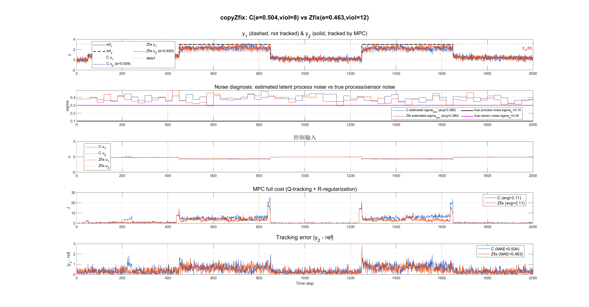

---

## 3. 版本演化总览

| 版本 | 相对基线修改 | 主要验证问题 | 实跑效果概述 |
|---|---|---|---|
| `main` | 原始 QR-IVR、旧差分 MPC、在线重辨识 | 历史起点 | 保存基线；存在坐标和风险口径问题 |
| `copyO_oblique` | 恢复斜投影双基，使用 $R^TP=I$ | 双基代数是否成立 | 双基测试通过，但旧控制逻辑下性能更差 |
| `copyP_centered_smpc` | 中心化、绝对预测、Boole 双侧约束 | 控制层是否能被独立修正 | QP 100%，零越界，跟踪良好 |
| `copyQ_control_aware` | 强制保留 tracked axes | 低阶模型是否丢失控制方向 | coverage=0，QP 100%，零越界 |
| `copyR_moqin_oblique` | 白化 IVR + 直接反白化 | 原始预测子空间能否直接用于控制 | 双基正确，但首步 QP 不可行 |
| `copyT_process_lv_smpc` | $p=30$ 工业过程、在线协方差更新 | 高维过程场景能否闭环运行 | QP 100%，MAE 0.081/0.061 |
| `copyU_smooth_noise_smpc` | 平滑时变噪声 | 噪声时变下是否稳定 | QP 100%，MAE 约 0.096/0.096 |
| `copyV_iterative_ivr` | 补空间 SVD 改为迭代 IVR | IVR 是否优于一次 SVD | 仅小幅变化，QP 100% |
| `copyW_fair_identifier_compare` | 固定 plant/controller，仅换辨识器 | 公平比较不同子空间方法 | 自由斜 IVR QP 仅 13%，control-aware 为 100% |
| `copyX_control_aware_oblique` | 在 Q/V 的 $P$ 上增加轻微斜读取器 | 保留 coverage 时斜投影能否运行 | QP 100%，但未优于 V |
| `copyY_no_whitening_direct_update` | 显式标记 copyX 无白化 | 澄清算法身份 | 与 X 数值逐位一致，不是新算法 |
| `copyZ_strict_whitened_copyX_plant` | 同一 plant 上执行白化和直接反白化 | 白化本身是否改善控制 | QP 39.67%，fallback 724，明显退化 |
| `copyOPQSTR_unified` | 统一所有参数，只保留 O/P/Q/R/S/T 算法差异 | 真正公平横向比较 | Q/P/S/T 可行；O/R 因 coverage 不足大量 fallback |

---

# 4. 各版本修改与实际效果

## 4.1 `copyO_oblique`：先修斜投影双基

### 修改内容

相对 `main`，copyO 不再简单用 QR 后令 $R=P$，而是从白化空间恢复：

$$
P_{\mathrm{raw}}=UD^{1/2}C^*,
\qquad
R_{\mathrm{raw}}=UD^{-1/2}C^*.
$$

再对：

$$
S=R_{\mathrm{raw}}^TP_{\mathrm{raw}}
$$

做 SVD 对齐，并构造完整对偶基，使：

$$
R^TP=I,
\quad
R^T\bar P=0,
\quad
\bar R^TP=0,
\quad
\bar R^T\bar P=I.
$$

### 实际效果

- 四个双基恒等式通过；
- 完整 2000 步运行完成；
- 旧参数下 C 的 $y_2$ MAE 为 3.2488；
- Oblique-SMPC 的 $y_2$ MAE 为 6.3173；
- Oblique 分支越界 26 次。

### 结论

copyO 修正的是**几何身份**，没有同步修正中心化、目标和风险约束，因此控制性能没有改善。

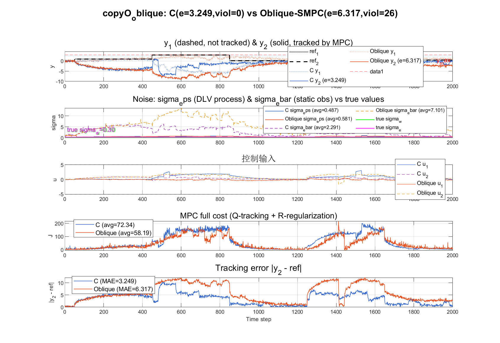

---

## 4.2 `copyP_centered_smpc`：先把控制层修正确

### 修改内容

copyP 暂时放弃一般斜投影，先使用正交特例：

$$
R=P,
\qquad
P^TP=I.
$$

同时统一中心化：

$$
y_k^c=y_k-\bar y,
\qquad
u_k^c=u_k-\bar u.
$$

采用绝对输出预测：

$$
\mu_y(j)=\bar y+PA^jz_k+G_j(U-U_0),
$$

以及正的 Boole 风险分配：

$$
\epsilon=\frac{\alpha_{\mathrm{joint}}}{2n_cN},
\qquad
z_\epsilon=\Phi^{-1}(1-\epsilon)>0.
$$

### 实际效果

| 指标 | $y_1$ | $y_2$ |
|---|---:|---:|
| MAE | 0.0931 | 0.0867 |
| RMSE | 0.1156 | 0.1082 |
| 越界 | 0 | 0 |

- QP 成功：1200/1200；
- 最大 chance residual：$-2.296\times10^{-1}$。

### 结论

基线的主要闭环问题并不只来自 $R=P$，控制坐标、预测目标和机会约束口径不一致同样关键。

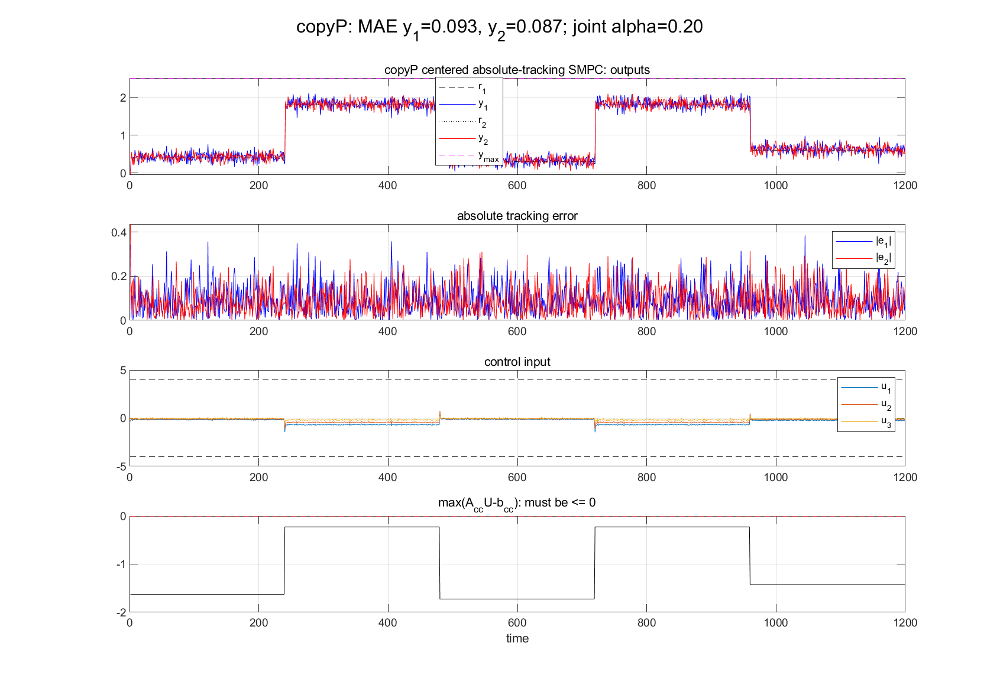

---

## 4.3 `copyQ_control_aware`：降维时强制保留控制方向

### 修改内容

copyQ 将维度降低，同时构造：

$$
P=[e_1,e_2,Q_\perp],
\qquad R=P.
$$

因此：

$$
PP^Te_i=e_i,
\qquad i=1,2.
$$

### 实际效果

| 指标 | $y_1$ | $y_2$ |
|---|---:|---:|
| MAE | 0.1142 | 0.0930 |
| RMSE | 0.1424 | 0.1176 |
| 越界 | 0 | 0 |

- tracked projection error：0；
- QP：1200/1200；
- 重构残差：0.3023。

### 结论

copyQ 牺牲部分非受控输出的重构精度，换取受控方向的结构性保留。这是 control-aware 扩展，不是原始 IVR 自然产生的性质。

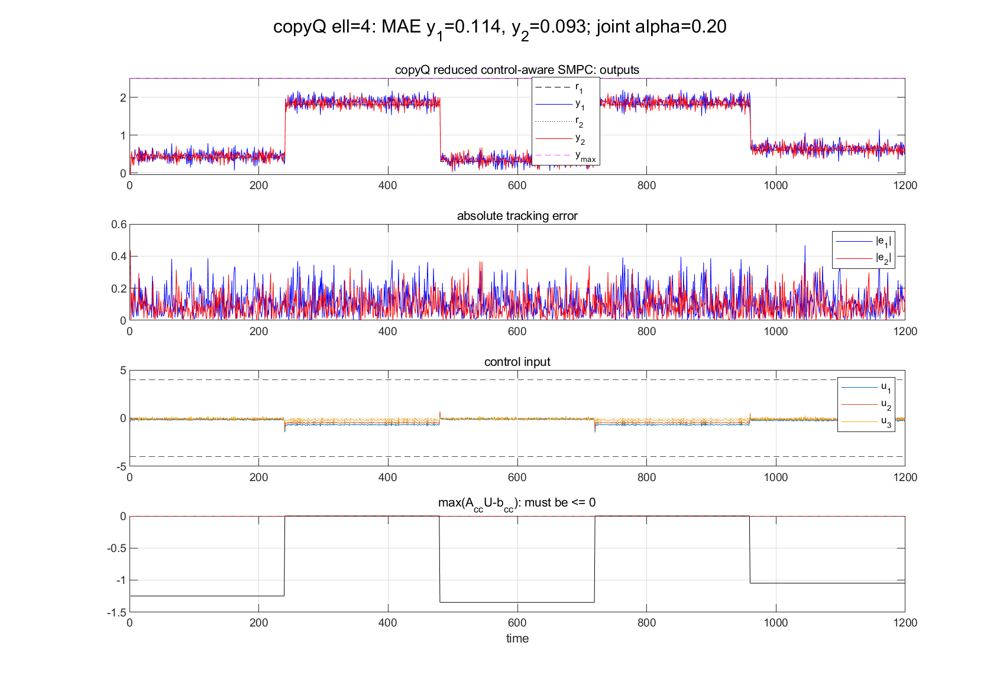

---

## 4.4 `copyR_moqin_oblique`：论文式白化基线

### 修改内容

copyR 执行：

$$
\Sigma_y=UDU^T,
\qquad
Y^*=D^{-1/2}U^TY^c,
$$

然后直接反白化：

$$
P=UD^{1/2}P^*,
\qquad
R=UD^{-1/2}P^*.
$$

不添加控制方向约束，不使用后验 QR/SVD 修复。

### 实际效果

- 双基误差约 $10^{-14}$；
- 但：
  $$
  \|PR^Te_1-e_1\|_2=2.34284,
  $$
  $$
  \|PR^Te_2-e_2\|_2=10.8190;
  $$
- 第一个 chance-constrained QP 就不可行；
- 完成步数 0/1200。

### 结论

预测性最优子空间不能自动保证控制任务可行。

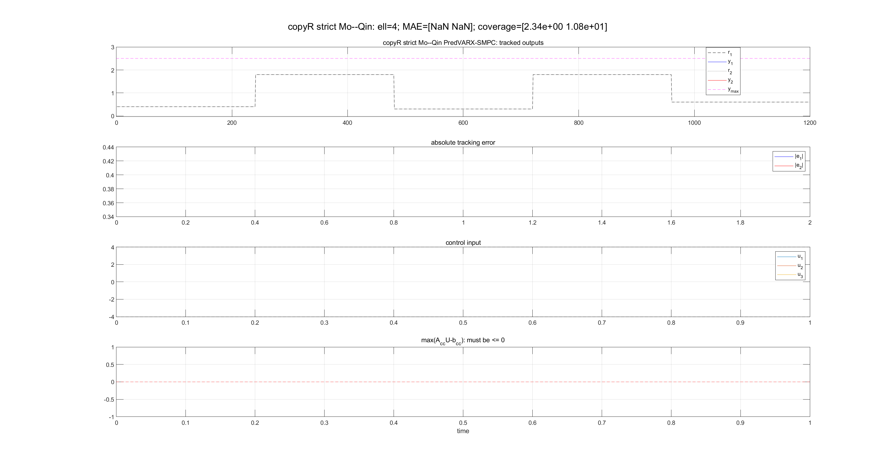

---

## 4.5 `copyT_process_lv_smpc`：高维工业过程验证

### 修改内容

copyT 将测试扩展到：

$$
p=30,\quad \ell=5,\quad tracked=[1,2].
$$

采用控制感知正交子空间，并在线更新：

$$
\Sigma_\varepsilon(k),
\qquad
\Sigma_{\mathrm{obs}}(k).
$$

结构参数：

$$
A,B,P,R
$$

保持固定。

### 实际效果

| 指标 | 数值 |
|---|---:|
| MAE | 0.0812 / 0.0609 |
| RMSE | 0.1047 / 0.0763 |
| QP 成功率 | 100% |
| fallback | 0 |
| tracked coverage error | 0 |
| constraint active rate | 65.90% |
| 平均代价 | 678.60 |

### 结论

高维 process-like 场景下，控制感知子空间、中心化 SMPC 和在线协方差更新可以形成完整闭环。但这是合成工业过程验证，不是真实工业数据结论。

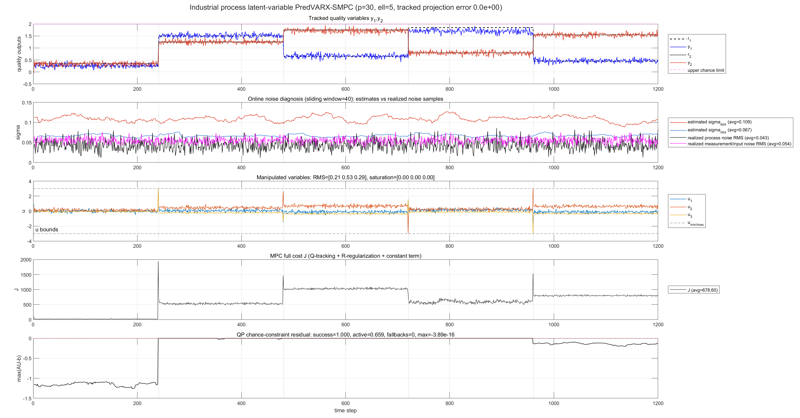

---

## 4.6 `copyU_smooth_noise_smpc`：平滑时变噪声

### 修改内容

相对 copyT，主要将固定噪声改成平滑变化：

$$
\sigma_w(k)\in[0.020,0.090],
$$

$$
\sigma_e(k)\in[0.025,0.100].
$$

并保持同一在线协方差估计和 SMPC 结构。

### 实际效果

| 指标 | 数值 |
|---|---:|
| MAE | 0.0959 / 0.0959 |
| RMSE | 0.1425 / 0.1385 |
| QP 成功率 | 100% |
| fallback | 0 |
| 平均代价 | 110.36 |
| 重构残差 | 0.1103 |

### 结论

在平滑时变噪声下，固定控制感知结构仍可稳定运行；但误差相对固定噪声 copyT 增大。

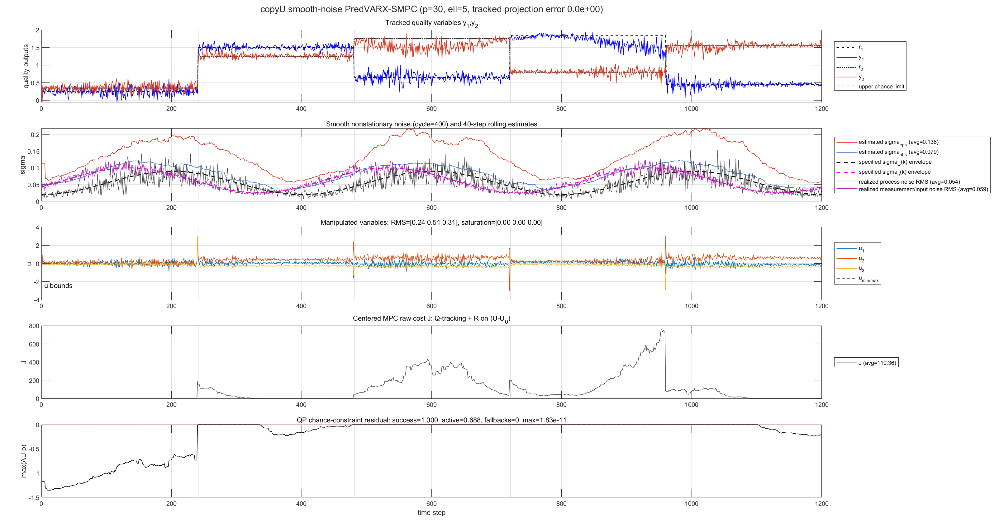

---

## 4.7 `copyV_iterative_ivr`：补空间改用迭代 IVR

### 修改内容

copyU 的补空间方向来自一次 SVD；copyV 改成在 tracked axes 的正交补中进行迭代预测方向更新：

$$
Y_\perp=N_\perp^TY^c
\rightarrow
V^{(0)}
\rightarrow
A_{\mathrm{IVR}}
\rightarrow
V^{(1)}
\rightarrow\cdots
$$

最终仍为正交结构：

$$
P=[E_c,N_\perp V],
\qquad R=P.
$$

### 实际效果

| 指标 | 数值 |
|---|---:|
| MAE | 0.0963 / 0.0953 |
| RMSE | 0.1429 / 0.1378 |
| QP 成功率 | 100% |
| fallback | 0 |
| 平均代价 | 107.91 |
| 重构残差 | 0.1190 |

### 结论

迭代 IVR 相比单次 SVD 只产生小幅差异，没有形成显著跟踪优势。

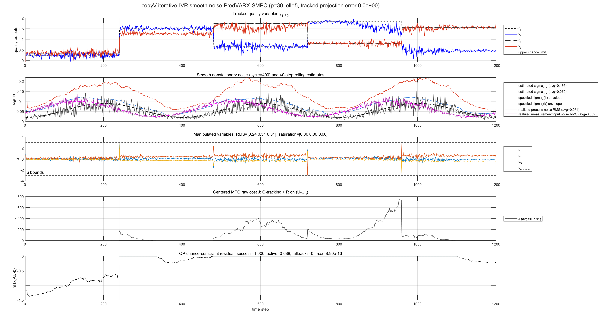

---

## 4.8 `copyW_fair_identifier_compare`：固定所有条件，只换辨识器

### 修改内容

copyW 不提出新控制器，而是在相同：

- plant；
- 离线数据；
- 随机噪声；
- 参考；
- SMPC；
- 约束；

下，仅比较四个辨识器。

### 实际效果

| 辨识器 | MAE | prediction RMSE | coverage error | QP / fallback |
|---|---:|---:|---:|---:|
| PCA/SVD | 0.0770 / 0.0788 | 0.0948 | 1.2995 | 100% / 0 |
| main QR-IVR | 0.0770 / 0.0843 | 0.0963 | 1.2989 | 100% / 0 |
| free oblique IVR | 0.9685 / 1.1231 | 0.2842 | 1.9038 | 13% / 1044 |
| control-aware IVR | 0.0917 / 0.0947 | 0.0995 | 0 | 100% / 0 |

### 结论

最低 prediction RMSE 并不等于结构性控制保证；control-aware 版本明确保证 coverage，而 PCA 在这个固定 plant 上虽未严格覆盖，仍碰巧得到良好闭环。

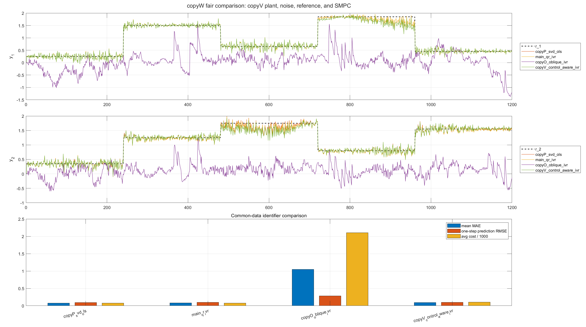

---

## 4.9 `copyX_control_aware_oblique`：在控制覆盖基础上加入轻微斜读取器

### 修改内容

copyX 保留 copyV 的生成基：

$$
P=[E_c,N_\perp V],
$$

但读取器改成：

$$
R_{\mathrm{full}}
=\widetilde\Sigma_y^{-1}P
(P^T\widetilde\Sigma_y^{-1}P)^{-1},
$$

$$
R_\alpha=P+\alpha(R_{\mathrm{full}}-P),
\qquad \alpha=0.02.
$$

确定 $R_\alpha$ 后重新辨识：

$$
z=R_\alpha^TY^c,
\qquad A,B,\Sigma_\varepsilon.
$$

### 白化事实

copyX 只做：

$$
Y^c=Y-\bar Y,
\qquad
Y_\perp=N_\perp^TY^c.
$$

它没有执行：

$$
Y^*=D^{-1/2}U^TY^c.
$$

因此 copyX **没有白化**。

### 实际效果

| 指标 | 数值 |
|---|---:|
| MAE | 0.0973 / 0.0950 |
| RMSE | 0.1444 / 0.1375 |
| QP 成功率 | 100% |
| fallback | 0 |
| 平均代价 | 109.16 |
| tracked coverage error | $1.03\times10^{-14}$ |
| dual error | $1.04\times10^{-14}$ |

### 结论

轻微斜读取器在不破坏控制覆盖时可以稳定运行，但当前指标没有优于正交 copyV。$\alpha=0.02$ 是展示斜投影可运行性的工程折中，不是预测或控制最优值。

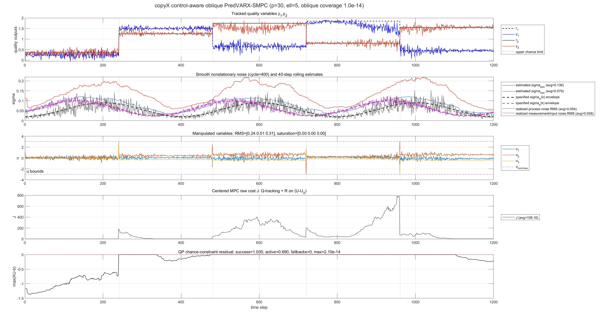

### copyV 与 copyX 直接对比

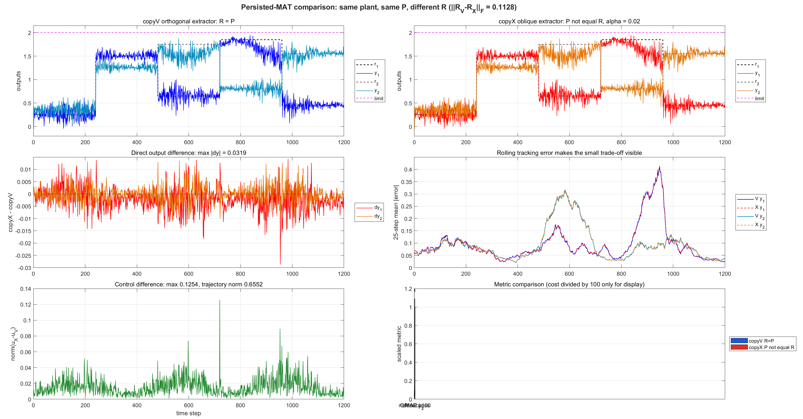

---

## 4.10 `copyY_no_whitening_direct_update`：给 copyX 正确贴标签

### 修改内容

copyY 显式记录：

```text
normalization_applied = 0
update_rule = direct_eigenspace_replacement
```

其算法和 copyX 数值路径相同，作用是纠正之前“copyX 已白化”的错误认知。

### 实际效果

copyY 与 copyX 的：

- MAE；
- RMSE；
- bias；
- QP 成功率；
- fallback；
- coverage；
- dual error；
- 平均代价；

全部逐位一致。

### 结论

copyY 是**算法身份审计版本**，不是新性能版本。

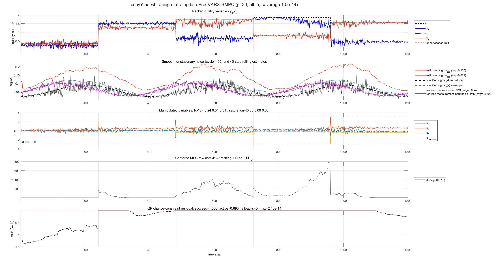

---

## 4.11 `copyZ_strict_whitened_copyX_plant`：同一 plant 下真正做白化

### 修改内容

copyZ 与 copyX 使用相同 plant、seed、参考、噪声、控制器和约束，只替换辨识过程：

$$
Y^*=D^{-1/2}U^TY^c,
$$

$$
P=UD^{1/2}P^*,
\qquad
R=UD^{-1/2}P^*.
$$

不强制 tracked axes，不使用 $R_\alpha$。

### 实际效果

| 指标 | copyX | copyZ |
|---|---:|---:|
| MAE $y_1$ | 0.0973 | 0.5172 |
| MAE $y_2$ | 0.0950 | 0.7246 |
| RMSE $y_1$ | 0.1444 | 0.7024 |
| RMSE $y_2$ | 0.1375 | 0.9747 |
| 平均代价 | 109.16 | 786.36 |
| QP 成功率 | 100% | 39.67% |
| fallback | 0 | 724 |
| coverage error | $\approx10^{-14}$ | 1.6327 |

copyZ 的双基误差仍为：

$$
\|R^TP-I\|_F=8.01\times10^{-15}.
$$

### 结论

copyZ 证明：白化和直接反白化可以在几何上完全正确，但如果预测子空间不覆盖控制方向，闭环仍可能严重退化。

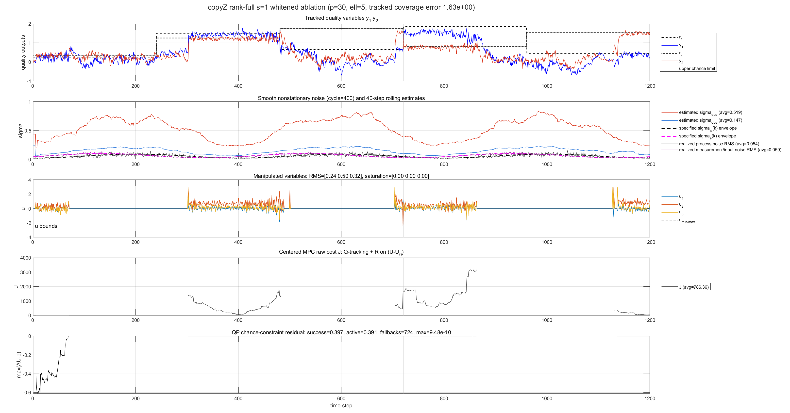

---

## 4.12 `copyOPQSTR_unified`：统一参数还原 O/P/Q/R/S/T

### 修改内容

历史 O/P/Q/R/S/T 的 plant 和参数不同，因此新增统一套件，固定：

```text
seed=20260710
n=6, m=3, p=30, ell=5
T_off=1500, T_cl=1200, N=18
tracked=[1 2]
u∈[-3,3], y_max=2.00
Q(y1,y2)=80, Ru=0.18I
```

只改变算法：

- O：自由斜投影 IVR；
- P：全局 PCA/SVD；
- Q：控制感知正交 IVR；
- R：白化与直接反白化；
- S：每 30 步在线结构重辨识；
- T：固定结构，仅在线更新协方差。

### 实际效果

| 方法 | MAE | prediction RMSE | coverage | QP / fallback | 在线重辨识 |
|---|---:|---:|---:|---:|---:|
| O | 0.9685 / 1.1231 | 0.2842 | 1.9038 | 13% / 1044 | 0 |
| P | 0.0770 / 0.0788 | 0.0948 | 1.2995 | 100% / 0 | 0 |
| Q | 0.0917 / 0.0947 | 0.0995 | 0 | 100% / 0 | 0 |
| R | 0.4451 / 0.7320 | 0.1473 | 1.6327 | 43.92% / 673 | 0 |
| S | 0.0807 / 0.0801 | 0.0990 | 0 | 100% / 0 | 40 |
| T | 0.0917 / 0.0947 | 0.0995 | 0 | 100% / 0 | 0 |

S 虽改善 MAE，但出现少量实际越界：

- $y_1$: 0.1667%；
- $y_2$: 0.0833%。

### 结论

统一实验进一步证明：

- O/R 的问题不是双基代数错误，而是 coverage 不足；
- Q/T 给出结构性控制保证；
- S 的在线重辨识改善跟踪，但必须重新审计风险校准；
- P 在当前 plant 上效果最好，但其成功是实验事实，不是一般 coverage 定理。

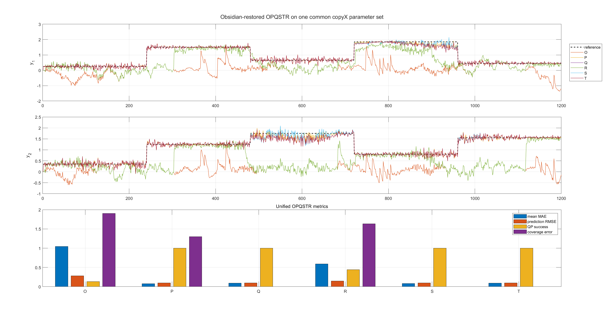

---

# 5. 从基线出发的修改链

## 5.1 几何链

```text
main
  └─ QR 正交化，近似 R=P
       ↓
copyO
  └─ 恢复一般斜投影双基
       ↓
copyR / copyZ
  └─ 直接执行白化—IVR—反白化
```

结论：

> 双基几何可以修到机器精度，但它只解决坐标 realization，不自动解决控制。

## 5.2 控制链

```text
main
  └─ 差分目标、中心化不一致、负风险分位数
       ↓
copyP
  └─ 中心化 + 绝对预测 + 正 Boole 收紧
       ↓
copyQ
  └─ 加入 tracked-axis coverage
       ↓
copyT / copyU
  └─ 高维过程 + 在线协方差适应
```

结论：

> 真正使闭环稳定的关键不是某一个投影公式，而是坐标、目标、约束和控制方向同时对齐。

## 5.3 辨识器链

```text
copyU：补空间一次 SVD
   ↓
copyV：补空间迭代 IVR
   ↓
copyX：加入轻微斜读取器
   ↓
copyY：明确无白化事实
   ↘
copyZ：同 plant 白化消融
```

结论：

- V 相对 U 只有小幅变化；
- X 的斜读取器可运行，但未优于 V；
- Y 不是新算法；
- Z 的白化几何成立，但失去控制覆盖后性能显著恶化。

---

# 6. 推荐如何引用这些版本

## 6.1 历史基线

使用：

```text
main/copyS_nosoft.m
```

只用于说明原始实现及其问题，不建议作为最终算法。

## 6.2 正确控制逻辑基线

使用：

```text
copyP_centered_smpc
```

说明中心化、绝对预测和 Boole 机会约束可以正确协同。

## 6.3 低阶控制感知基线

使用：

```text
copyQ_control_aware
```

或高维同族：

```text
copyV_iterative_ivr
```

它们提供明确的 tracked-output coverage。

## 6.4 斜投影工程扩展

使用：

```text
copyX_control_aware_oblique
```

但应写明：

- 无白化；
- $\alpha=0.02$ 是轻微斜投影折中；
- 未证明优于正交版本。

## 6.5 白化反例/消融

使用：

```text
copyZ_strict_whitened_copyX_plant
```

它是最公平的 copyX 白化对照，但不是完整 Algorithm 1。

## 6.6 公平横向结果

优先使用：

```text
copyW_fair_identifier_compare
copyOPQSTR_unified
```

因为它们固定了 plant、数据、噪声、参考和控制器。

---

# 7. 最终综合判断

| 问题 | 当前证据回答 |
|---|---|
| 原始基线能否直接作为最终版本？ | 不能，存在坐标和风险口径问题 |
| 斜投影双基是否能正确实现？ | 能，copyO/X/R/Z 均达到机器精度级双基误差 |
| 双基正确是否意味着控制好？ | 不意味着，O/R/Z 是明确反例 |
| 白化是否一定改善闭环？ | 不一定；同 plant 下 copyZ 明显弱于 copyX |
| 控制方向覆盖是否重要？ | 非常重要；copyW 和统一 OPQSTR 均给出证据 |
| 在线重辨识是否一定更好？ | 不一定；S 改善 MAE，但出现少量经验越界 |
| 当前最稳妥的结构是什么？ | 控制感知子空间 + 坐标一致 VARX + 正确 SMPC |
| copyX 是否是最终最优版本？ | 不是；它是可运行的轻微斜投影原型，未优于 V |

最终建议的研究主线是：

$$
\boxed{
\text{control-aware }P
\;\longrightarrow\;
\text{coordinate-consistent }R,A,B
\;\longrightarrow\;
\text{online uncertainty update}
\;\longrightarrow\;
\text{risk-calibrated SMPC}
}
$$

而不是先假设：

$$
\text{白化} \Rightarrow \text{控制更好},
$$

或：

$$
R^TP=I \Rightarrow \text{闭环可行}.
$$

---

# 8. 文件与复现入口

本文：

```text
docs/version-summary/PREDVARX_MPC_VERSION_SUMMARY.md
```

图片：

```text
docs/version-summary/assets/*.png
```

已有详细表：

```text
VERSION_EVOLUTION_AND_METRICS.md
LEGACY_COPY_OPQSTR_ARCHAEOLOGY.md
```

统一参数复现：

```matlab
run('experiments/copyOPQSTR_unified/tests/test_copyOPQSTR_unified.m')
run('experiments/copyOPQSTR_unified/copyOPQSTR_unified.m')
```

> 说明：不同历史版本的 MAE 只有在 plant、参数、参考和控制器一致时才能横向排名。本文保留历史结果用于说明演化，但真正公平的算法比较应以 copyW 和 copyOPQSTR_unified 为主。
